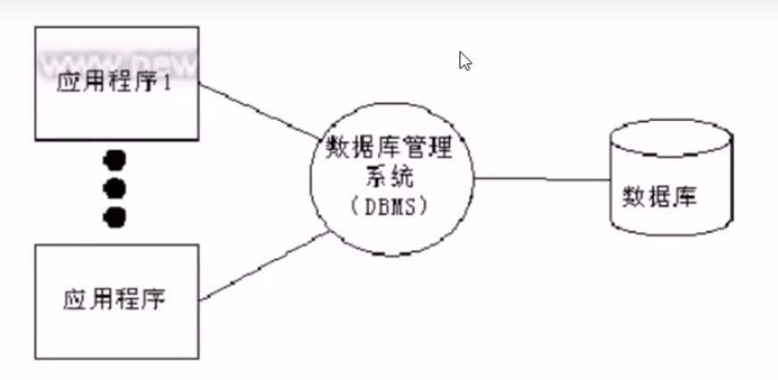
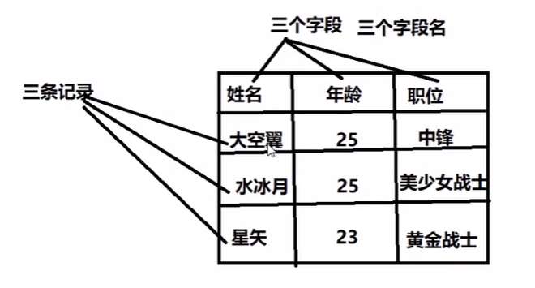
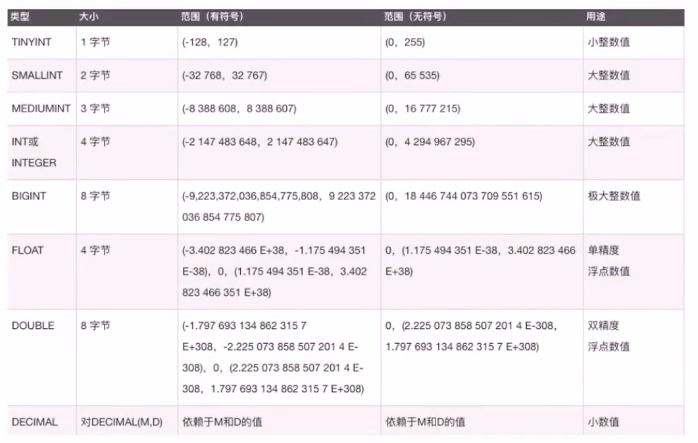
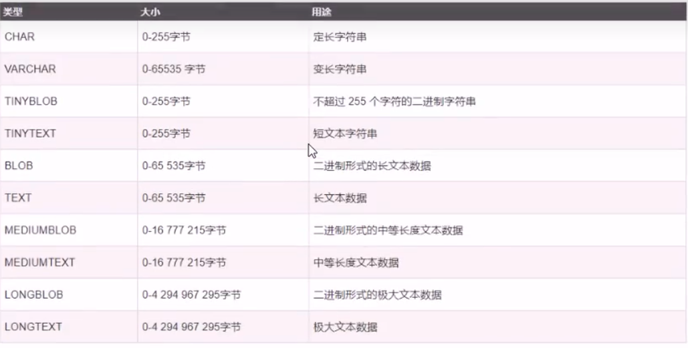
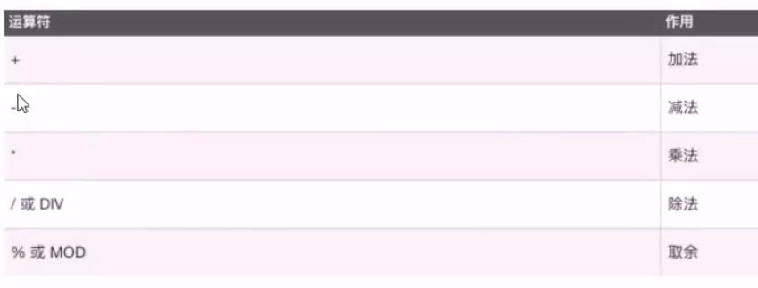

# MySQL数据库

|Tede Python 教学部|
|--|
|Author:吕泽|
|Days:2天|

- 数据库概述
  - 数据存储阶段
  - 数据库应用
  - 基础概念
  - 数据库分类和常见数据库
  - 认识关系型数据库和MySQL
- SQL语句
- MySQL数据库操作
  - 数据库操作
  - 数据表的管理
- 数据基本操作
  - 插入(insert)
  - 查询(select)
  - where子句
    - 算数运算符
    - 比较运算符
    - 逻辑运算符
    - 位运算符
  - 更新表记录（update）
  - 删除表记录（delete）
  - 表字段的操作（alter）
  - 时间类型数据
    - 时间格式
    - 日期时间函数
    - 时间操作
  - 高级查询语句
    - 模糊查询和正则查询
    - 排序
    - 分页
    - 联合查询
  - 数据备份
- Python操作MySQL数据库
  - pymysql安装
  - pymysql使用流程
    - 常用函数

## 数据库概述

### 数据存储阶段

【1】人工管理阶段

缺点︰数据无法共享,不能单独保持,数据存储量有限

【2】文件管理阶段( .txt .doc .xls )

优点︰数据可以长期保存,可以存储大量的数据,使用简单
缺点︰数据一致性差,数据查找修改不方便,数据冗余度可能比较大

【3】数据库管理阶段

优点∶数据组织结构化降低了冗余度,提高了增删改查的效率,容易扩展，方便程序调用，做自动化处理
缺点︰需要使用sql或者其他特定的语句，相对比较复杂

### 数据库应用

> 融机构、游戏网站、购物网站、论坛网站......



### 基础概念

> 数据︰能够输入到计算机中并被识别处理的信息集合
> 数据结构︰研究一个数据集合中数据之间关系的
> 数据库︰按照数据结构，存储管理数据的仓库。数据库是在数据库管理系统管理和控制下，在一定介质上的数据集合。
> 数据库管理系统∶管理数据库的软件，用于建立和维护数据库
> 数据库系统︰由数据库和数据库管理系统，开发工具等组成的集合

### 数据库分类和常见数据库

- 关系型数据库和非关系型数据库

> 关系型︰采用关系模型(二维表)来组织数据结构的数据库
> 非关系型:不采用关系模型组织数据结构的数据库

- 开源数据库和非开源数据库

> 开源:MySQL、sQLite、MongoDB
> 非开源︰Oracle、DB2、SQL_Server

- 常见的关系型数据库

>MySQL、Oracle、SQL_Server、DB2 SQLite

### 认识关系型数据库和MySQL

1.数据库结构（图库结构)

> 数据元素-->记录-->数据表-->数据库


2.数据库概念解析

>数据表︰存放数据的表格
>字段︰每个列，用来表示该列数据的含义
>记录:每个行，表示一组完整的数据



3.MySQL特点

- 是开源数据库，使用C和C++编写
- 能够工作在众多不同的平台上
- 提供了用于C、C++、Python、Java、Perl、PHP、Ruby众多语言的API
- 存储结构优良，运行速度快。功能全面丰富

4.MySQL安装

> Ubuntu安装MySQL服务
>> 安装服务端: sudoapt-get install mysql-server
>> 安装客户端: sudo apt-get install mysql-client
>>> 配置文件:/etc/mysql
>>> 命令集:/usr/bin
>>> 数据库存储目录:/var/lib/mysql
>
> Windows安装MySQL
>> 下载MySQL安装包(windows)
>> https:/ldev.mysql.com/downloads/mysql/mysql-installer*****.msi
>> 一定要在32bit下载安装器，用这个安装器也可以安装64bit。
>>
>> 安装教程去安装

5.启动和连接MySQL服务

> 服务端启动
>> 查看MySQL状态: sudo /etc/init.d/mysql status
>> 启动服务: sudo /etc/init.d/mysql start | stop | restart
>
> 客户端连接
>> 命令格式
>>> mysql -h主机地址-u用户名-p密码
>>> mysql -hlocalhost -uroot -p123456
>>> 本地连接可省略-h选项: mysql -uroot -p123456
>
> 关闭连接
>> ctrl-D
>> exit

## SQL语句

> 什么是SQL
>> 结构化查询语言(Structured Query Language)，一种特殊目的的编程语言，是一种数据库查询和程序设计语言，用于存取数据以及查询、更新和管理关系数据库系统。
>
> SQL语句使用特点
>
> - SQL语言基本上独立于数据库本身
> - 各种不同的数据库对SQL语言的支持与标准存在着细微的不同
> - 每条命令必须以;结尾
> - SQL命令关键字不区分字母大小写

## MySQL数据库操作

### 数据库操作

1.查看已有库

> show databases;

2.创建库(指定字符集)

> create database 库名[character set utf8];

```sql
e.g. 创建stu数据库，编码为utf8
create database stu character set utf8;
create database stu charset utf8;
```

3.查看创建库的语句(字符集)

> show create database 库名;

```sql
e.g. 查看stu创建方法
show create database stu；
```

4.查看当前所在库

> select database();

5.切换库

> use database;

```sql
e.g. 使用stu数据库
use stu；
```

6.删除库

> drop database 库名;

```sql
e.g. 删除test数据库
drop database test；
```

7.库名的命名规则

> - 数字、字母、下划线，但不能使用纯数字
> 库名区分大小写
> 不能使用特殊字符和mysql关键字

### 数据表的管理

1.表结构设计初步

【1】分析存储内容
【2】确定字段构成
【3】设计字段类型

2.数据类型支持

- 数字类型：

>> 整数类型（精确值） - INTEGER, INT, SMALLINT, TINYINT, MEDIUMINT, BIGINT
>> 定点类型（精确值） - DECIMAL
>> 浮点类型（近似值） - FLOAT, DOUBLE
>> 比特值类型 - BIT



> 对于精度比较高的东西，比如money，用decimal类型提高精度减少误差。列的声明语法是DECIMAL(M,D)。
>> M是数字的最大位数（精度)。其范围为1~65，M的默认值是10。
>> D是小数点右侧数字的数目（标度)。其范围是0～30，但不得超过M。
>> 比如DECIMAL(6,2)最多存6位数字，小数点后占2位,取值范围-9999.99到9999.99。
>
> 比特值类型指0，1值表达2种情况，如真，假

- 字符串类型：

>> CHAR和VARCHAR类型
>> BINARY和VARBINARY类型
>> BLOB和TEXT类型
>> ENUM类型和SET类型



- char和varchar

>char:定长，效率高，一般用于固定长度的表单提交数据存储，默认1字符
> varchar:不定长，效率偏低

- text和blob

> text用来存储非二进制文本
> blob用来存储二进制字节串

- enum和set

> enum用来存储给出的一个值
> set用来存储给出的值中一个或多个值

3.表的基本操作

- 创建表(指定字符集)

>> create table 表名(
  字段名 数据类型,
  字段名 数据类型,
  ...
  字段名 数据类型
  );
>>
>> - 如果你想设置数字为无符号则加上unsigned
>> - 如果你不想字段为NULL可以设置字段的属性为NOT NULL，在操作数据库时如果输入该字段的数据为NULL，就会报错。
>> - DEFAULT表示设置一个字段的默认值
>> - AUTO_INCREMENT定义列为自增的属性，一般用于主键，数值会自动加1。
>> - PRIMARY KEY关键字用于定义列为主键。主键的值不能重复。

```sql
e.g. 创建班级表
create table class_1(id int primary key auto_increment, name varchar(32) not null, age int unsigned not null, sex enum("w","m"),score float default 0.0)；

e.g. 创建兴趣班表
create table interest(id int primary key auto_increment, name varchar(32) not null,hobby set("sing","dance","draw"),price decimal(7,2),level char not null, comment text);
```

- 查看数据表

> show tables;

- 查看已有表的字符集

> show create table 表名;

- 查看表的结构

> desc.表名

```sql
mysql>desc class;
+-------+---------------+------+-----+---------+----------------+
| Field | Type          | Null | Key | Default | Extra          |
+-------+---------------+------+-----+---------+----------------+
| id    | int           | NO   | PRI | NULL    | auto_increment |
| name  | varchar(32)   | NO   |     | NULL    |                |
| age   | int           | NO   |     | NULL    |                |
| sex   | enum('w','m') | YES  |     | NULL    |                |
| score | float         | YES  |     | 0       |                |
+-------+---------------+------+-----+---------+----------------+
5 rows in set (0.02 sec)
```

- 删除表

> drop table 表名;

## 数据基本操作

### 插入（inset）

```sql
insert into 表名 values(值1),(值2),...;
insert into 表名 (字段1,...) values(值1),(值2),...;
```

```sql
insert into class values(1,"Abby",18,"w",89.5),(2,'Baron',10,"m",91);
insert into class (name,age,sex) values("Jame",17,"m")
```

### 查询（select）

```sql
select * from 表名 [where 条件]；
select 字段1,字段2 from 表名 [where 条件];
```

```sql
e.g.
select * from class;
select name,age from class;
```

### where子句

where子句在sql语句中扮演了重要角色，主要通过一定的运算条件进行数据的筛选

MySQL主要有以下几种运算符∶

> 算术运算符
> 比较运算符
> 逻辑运算符
> 位运算符

#### 算数运算符



```sql
e.g.
select * from class where age % 2 = 0;
```

#### 比较运算符

|符号|描述|备注|
|--|--|--|
|=|等于||
|<>,!=|不等于||
|>|大于||
|<|小于||
|<=|小于等于||
|>=|大于等于||
|BETWEEN|在两值之间|>=min&&<=max|
|NOT BETWEEN|不在两值之间||
|IN|在集合中||
|NOT IN|不在集合中||
|<=>|严格比较两个NULL值是否相等|两个操作码均为NULL时，其所得之为1；而当一个操作码为NULL时，其所得值为0|
|LIKE|模糊匹配||
|REGEXP 或 RLIKE|正则式匹配||
|IS NULL|为空||
|IS NOT NULL|不为空||

```sql
e.g.
select * from class where age>8;
select * from class where age between 8 and 10;
select * from class where age in (8,9);
```

#### 逻辑运算符

|运算符号|作用|
|--|--|
|NOT 或!|逻辑非|
|AND|逻辑与|
|OR|逻辑或|
|XOR|逻辑异或|

```sql
e.g.
select * from class where sex="m" and age>9;
```

#### 位运算符

|运算符号|作用|
|--|--|
|&|按位与|
|\||按位或|
|^|按位异或|
|~|取反|
|<<|左移|
|>>|右移|

|优先级顺序|运算符|
|--|--|
|1|:=|
|2|||,OR,XOR|
|3|&&,AND|
|4|NOT|
|5|BETWEEN,CASE,WHEN,THEN,ELSE|
|6|=,<=>,>=,>,<=,<,<>,!=,IS,LIKE,REGEXP,IN|
|7|||
|8|&|
|9|<<,>>|
|10|-+|
|11|*,/,DIV,%,MOD|
|12|^|
|13|-(一元减号，比如-5),~(一元比特反转)|
|14|!|

### 更新表记录（update）

```sql
update 表名 set 字段1=值1,字段2=值2,... where 条件;

e.g.
update class set age=11 where name="Abby";
```

### 删除表记录（delete）

```sql
delete from 表名 where 条件;

注意：delete语句后如果不加where条件，所有记录全部清空

e.g.
delete from class where name="Abby";
```

### 表字段的操作（alter）

```sql
语法：alter table 表名 执行动作;

* 添加字段(add)
    alter table 表名 add 字段名 数据类型;
    alter table 表名 add 字段名 数据类型 first;
    alter table 表名 add 字段名 数据类型 after 字段名;

* 删除字段(drop)
    alter table 表名 drop 字段名;
    
* 修改数据类型(modify)
    alter table 表名 modify 字段名 新数据类型;

* 修改字段名(change)
    alter table 表名 change 旧字段名 新字段名 新数据类型;

* 重命名表(rename)
    alter table 表名 rename 新表名;

e.g.
alter table interest add date Date after course;
```

### 时间类型数据

> 时间和日期类型：
>> DATE, DATETIME和TIMESTAMP类型
>> 年份类型YEAR

|类型|大小（字节）|范围|格式|用途|
|--|--|--|--|--|
|DATE|3|1000-01-01/9999-12-31|YYYY-MM-DD|日期值|
|TIME|3|'-838:59:59'/'838:59:59'|HH:MM:SS|时间值或持续时间|
|YEAR|1|1901/2155|YYYY|年份值|
|DATETIME|8|1000-01-01 00:00:00/9999-12-31 23:59:59|YYYY-MM-DD HH:MM:SS|混合日期和时间值|
|TIMESTAMP|4|1970-01-01 00:00:00/2038 结束时间是第2147483647秒，北京时间2038-1-19 11:14:07，格林尼治时间2038年1月19日凌晨 03:14:07|YYYYMMDD HHMMSS|混合日期和时间，时间戳|

#### 时间格式

> date:"YYYY-MM-DD"
> time:"HH:MM:SS"
> datetime:"YYYY-MM-DD HH:MM:SS"
> timestamp:"YYYY-MM-DD HH:MM:SS"
> 注意
> 1、datetime：不给值默认返回NULL值
> 2、timestamp：不给值默认返回系统当前时间

#### 日期时间函数

- now()返回服务器当前时间
- curdate()返回当前日期
- curtime()返回当前时间
- date(date)返回指定时间的日期
- time(date)返回指定时间的时间

#### 时间操作

- 查找操作

```sql
select * from timelog where Date = "2018-07-02";
select * from timelog where Date >= "2018-07-01" and Date <= "2018-07-31";
```

- 日期时间运算
  - 语法格式
    select * from 表名 字段名 运算符 (时间-interval时间间隔单位);
  - 时间间隔单位: 1 day | 2 hour| 1 minute | 2 year | 3 month

```sql
select * from timelog where shijian > (now()-interval 1 day);
select * from marathon where result > (time("03:00:00")-interval 1 day);
```

### 高级查询语句

#### 模糊查询和正则查询

LIKE用于再where子句中进行模糊查询，SQL LIKE子句中使用百分号%来表示任意0个或多个字符，下划线_表示任意一个字符。

使用LIKE子句从数据表中读取数据的通用语法:

```sql
SELECT field1, field2, ... fieldN
FROM table_name
WHERE field1 LIKE condition1

e.g.
select * from class where name like 'A%';
```

mysql中对正则表达式的支持有限，只支持部分正则元字符

```sql
SELECT field1, field2, ... fieldN
FROM table_name
WHERE field1 REGEXP condition1

e.g.
select * from class where name regexp 'B.+';
```

#### 排序

ORDER BY子句来设定你想按那个字段哪种方式来进行排序，再返回搜索结果。

使用ORDER BY子句将查询数据排序后再返回数据：

```sql
SELECT field1, field2, ... fieldN
FROM table_name
WHERE condition1 ORDER BY field1[ASC[DESC]]
```

默认情况ASC表示升序，DESC表示降序

```sql
e.g.
select * from class where sex="m" order by date desc;
```

#### 分页

LIMIT子句用于限制由SELECT语句返回的数据数量或者UPDATE，DELETE语句的操作数量

带有LIMIT子句的SELECT语句的基本语法如下：

```sql
SELECT field1, field2, ... fieldN
FROM table_name
WHERE condition1
LIMIT [num]

e.g.
delete from class where age=17 LIMIT 1;  # 删除年龄为17的记录，但只删除一个
```

#### 联合查询

UNION操作符用于连接两个以上的SELECT语句的结果组合到一个结果集合中。多个SELECT语句会删除重复的数据。

使用UNION和使用where子句中的AND效果上是一样的，但是这样再后台的效率更高。

另外UNION可以再不同的表里查询。

UNION操作符语法格式:

```sql
SELECT expression1, expression2, ... expressionN
FROM table_name
[WHERE condition2]
UNION [ALL | DISTINCT]
SELECT expression1, expression2, ... expressionN
FROM table_name
[WHERE condition2]
```

> expression1, expression2, ... expression_n:要检索的字段。
> table_name: 要检索的数据表
> WHERE conditions：可选，检索条件
> DISTINCT：可选，删除结果集中重复的数据。默认情况下UNION操作符已经删除了重复数据，所以DISTINCT修饰符对结果没啥影响。
> ALL：可选，返回所有结果集，包含重复数据。

```sql
e.g.
delete * from class where sex="m" UNION select * from class where age<17
```

### 数据备份

1.备份命令格式

> mysqldump -uroot -p 源库名 > ~/***.sql
> 源库名可以写一下选项
>> --all-databases 备份所有库
>> 库名 备份单个库
>> -B 库1 库2 库3 备份多个库
>> 库名 表1 表2 表3 备份指定库的多张表

2.恢复命令格式

> mysql -uroot -p 目标库名 < ***.sql
> 前提目标库名需要存在于已有的数据库中
> 从所有库备份中恢复某一个库(--one-database)
>> mysql -uroot -p --one-database 目标库名 < all.sql

## Python操作MySQL数据库

### pymysql安装

> sudo pip3 install pymysql

### pymysql使用流程

1.建立数据库连接（db = pymysql.connect(...)）
2.创建游标对象（c = db.cursor()）
3.游标方法：c.execute("insert ...")
4.提交到数据库：db.commit()  # 只有写操作需要这一步
5.关闭游标对象：c.close()
6.断开数据库连接：db.close()

#### 常用函数

> db = pymysql.connect(参数列表)
>> host:主机地址，本地localhost
>> port:端口号，默认3306
>> user:用户名
>> password:密码
>> database:库
>> charset:编码方式，推荐使用utf8
>
> 数据库连接对象(db)的方法
>> db.commit() 提交到数据库执行
>> db.rollback() 回滚
>> cur = db.cursor() 返回游标对象，用于执行具体SQL命令
>> db.close() 关闭连接
>
> 游标对象(cur)的方法
>> cur.execut(sql命令, [列表]) 执行SQL命令
>> cur.close() 关闭游标对象
>> cur.fetchone() 获取查询结果集的第一条树(1,100001,"河北省")
>> cur.fetchmany(n) 获取n条((记录1),(记录2))
>> cur.fechall() 获取所有记录
