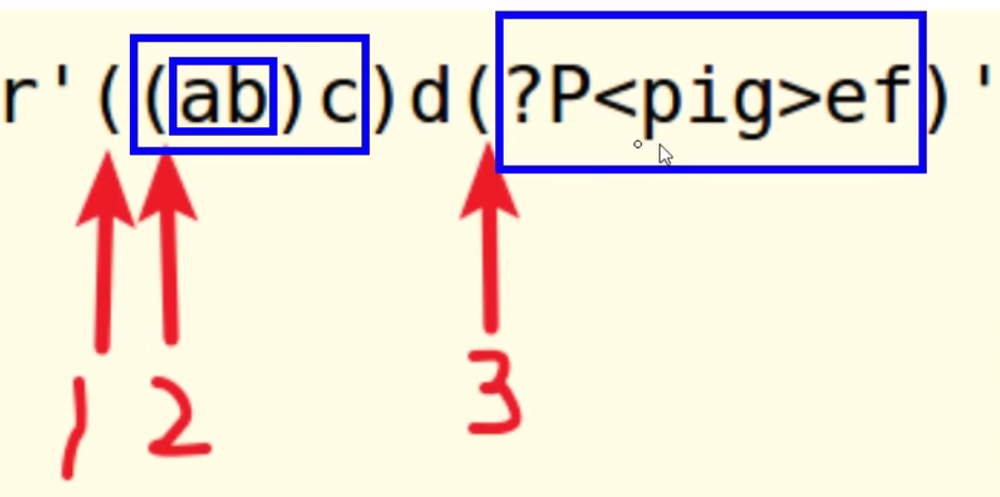
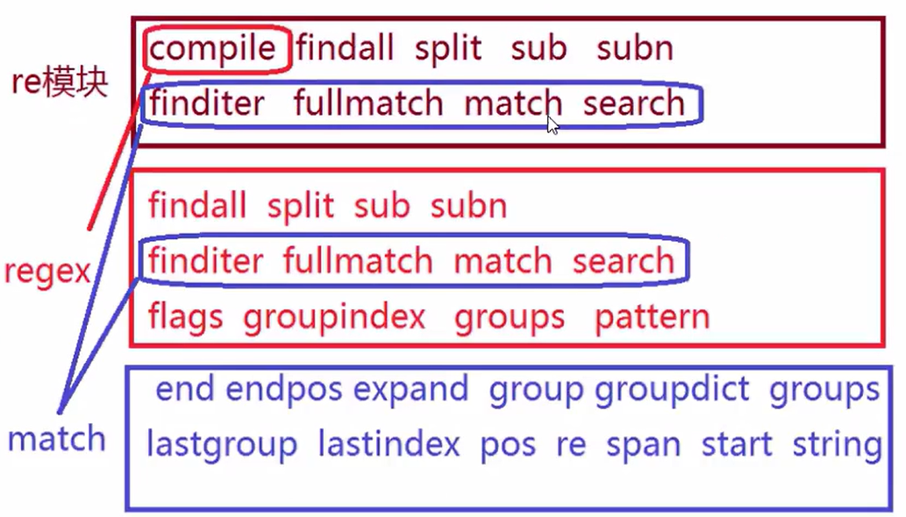

# 正则表达式 Regular Expression

|Tedu Python教学部|
|--|
|Author：吕泽|
|days：1天|

- 动机
- 简介
- 元字符使用
  - 普通字符
  - 或关系
  - 匹配单个字符
  - 匹配字符集
  - 匹配字符集反集
  - 匹配字符串开始位置
  - 匹配字符串的结束位置
  - 匹配字符重复
  - 匹配任意（非）数字字符
  - 匹配任意（非）普通字符
  - 匹配任意（非）空字符
  - 匹配开头结尾位置
  - 匹配（非）单词的边界位置
- 正则表达式的转义
- 贪婪模式和非贪婪模式
- 正则表达式分组
- 先行断言(lookahead)和后行断言(lookbehind)
- 正则表达式匹配原则
- Python re模块使用
  - match对象的属性方法
  - flags参数扩展

## 动机

1.文本处理已经成为计算机常见工作之一
2.对文本内容的搜索，定位，提取是逻辑比较复杂的工作
3.为了快速方便的解决上述问题，产生了正则表达式计数

## 简介

1.定义

> 即文本的高级匹配模式，提供搜索、替换等功能。其本质是由一系列字符和特殊符号构成的字串，这个字串即正则表达式。

2.原理

> 通过普通字符和有特定含义的字符，来组成字符串，用以描述一定的字符串规则，比如：重复、位置等，来表达某类特定的字符串，进而匹配。

3.目标

- 熟练掌握正则表达式元字符
- 能够读懂常用正则表达式，编辑简单的正则规则
- 能够熟练使用re模块操作正则表达式

## 元字符使用

### 普通字符

- 匹配规则：每个普通字符匹配其对应的字符

```text
e.g.
In: re.findall("ab", "abcdefabcd")
Out: ['ab', 'ab']
```

- 注意事项：正则表达式在python中也可以匹配中文

### 或关系

- 元字符：|
- 匹配规则：匹配|两侧任意的正则表达式即可

```text
e.g.
In: re.findall("com|cn", "www.baidu.com/www.tmooc.cn")
Out: ['com', 'cn']
```

### 匹配单个字符

- 元字符：.
- 匹配规则：匹配除换行外的任意一个字符

```text
e.g.
In: re.findall("张.丰", "张三丰，张四丰，张五丰")
Out: ['张三丰', '张四丰', '张五丰']
```

### 匹配字符集

- 元字符：[字符集]
- 匹配规则：匹配字符集中的任意一个字符
- 表达形式：

>> [abc#!好]表示[]中的任意一个字符
>> [0-9],[a-z],[A-Z]表示区间内的任意一个字符
>> [_#?0-9a-z]混合书写，一般区间表达写在后面

```text
e.g.
In: re.findall("[aeiou]", "How are you!")
Out: ["o", "a", "e", "o", "u"]
```

### 匹配字符集反集

- 元字符：[^字符集]
- 匹配规则：匹配除了字符集以外的任意一个字符

```text
e.g.
In: re.findall("[^0-9]", "Use 007 port")
Out: ["U", "s", "e", " ", " ", "p", "o", "r", "t"]
```

### 匹配字符串开始位置

- 元字符：^
- 匹配规则：匹配目标字符集的开头位置

```text
e.g.
In: re.findall("^Jame", "Jame, hello")
Out: ["Jame"]
```

### 匹配字符串的结束位置

- 元字符：$
- 匹配规则：匹配目标字符集的结尾位置

```text
e.g.
In: re.findall("Jame$", "Hi, Jame")
Out: ["Jame"]
```

- 规则技巧：^和$必然出现在正则表达式的开头和结尾处。如果两者同时出现，则中间的部分必须匹配整个目标字符串的全部内容。

### 匹配字符重复

- 元字符：*
- 匹配规则：匹配前面的字符出现0次或多次

```text
e.g.
In: re.findall("wo*", "wooooo~~w")
Out: ["wooooo", "w"]
```

- 元字符：+
- 匹配规则：匹配前面的字符出现1次或多次

```text
e.g.
In: re.findall("[A-Z][a-z]+", "Hello World")
Out: ["Hello", "World"]
```

- 元字符：?
- 匹配规则：匹配前面的字符出现0次或1次

```text
e.g.
In: re.findall("-?[0-9]+", "Jame, age:18, -26")
Out: ["18", "-26"]
```

- 元字符：{n}
- 匹配规则：匹配前面的字符出现n次

```text
e.g. 匹配手机号码
In: re.findall("1[0-9]{10}", "Jame: 13885349234")
Out: ["13885349234"]
```

- 元字符：{m-n}
- 匹配规则：匹配前面的字符出现m次到n次

```text
e.g. 匹配qq号码
In: re.findall("[1-9][0-9]{5, 10}", "Baron: 12592969941")
Out: ["12592969941"]
```

### 匹配任意（非）数字字符

- 元字符：\d \D
- 匹配规则：\d匹配任意数字字符，\D匹配任意非数字字符

```python
e.g. 匹配端口
re.findall("\d{1,5}","Mysql:3306, http:80")
Out: ['3306', '80']
```

### 匹配任意（非）普通字符

- 元字符：\w \W
- 匹配规则：\w匹配普通字符，\W匹配非普通字符

说明：普通字符指数字，字母，下划线，汉字。

```python
e.g.
re.findall("\w+","server_port = 8888")
Out: ['server_port', '8888']
```

### 匹配任意（非）空字符

- 元字符：\s \S
- 匹配规则：\s匹配普通字符，\S匹配非普通字符
- 说明：空字符指 空格 \r \n \t \v \f字符 (\v垂直制表符 \f换页符)

```python
e.g.
re.findall("\w+\s+\w+","hello world")
Out: ['hello world']
```

### 匹配开头结尾位置

- 元字符：\A \Z
- 匹配规则：\A表示开头位置，\Z表示结尾位置

### 匹配（非）单词的边界位置

- 元字符：\b \B
- 匹配规则：\b表示单词边界，\B表示非单词边界
- 说明：单词边界指数字字母（汉字）下划线与其他字符的交接位置

```python
e.g.
re.findall(r"\bis\b","This is a test.")
Out: ['is']
```

|类别|元字符|
|--|--|
|匹配字符|. [...] [^...] \d \D \w \W \s \S|
|匹配重复|* + ? {n} {m,n}|
|匹配位置|^ $ \A \Z \b \B|
|其他|\| () \\|

## 正则表达式的转义

1.如果使用正则表达式匹配特殊字符则需要加\表示转义。

>> 特殊字符：. * + ? ^ $ [] () {} | \

```text
e.g. 匹配特殊字符.时使用\.表示本身含义
re.findall("-?\d+\.?\d*","123, -123, 1.23, -1.23")
Out: ['123', '-123', '1.23', '-1.23']
```

2.在编程语言中，常使用原生字符串书写正则表达式避免多重转移的麻烦。

```text
e.g.
python字符串  -->     正则      -->   目标字符串
"\\$\\d+"  解析为   \$\d+     匹配     “$10e"
"\\$\\d+"  等同于  r"\$\d+"
```

## 贪婪模式和非贪婪模式

1.定义

> 贪婪模式:默认情况下，匹配重复的元字符总是尽可能多的向后匹配内容。比如:* + ? {m,n}
>
> 非贪婪模式(懒惰模式):让匹配重复的元字符尽可能少的向后匹配内容。

2.贪婪模式转换为非贪婪模式

- 在匹配重复元字符后加?号即可

```text
*       :   *?
+       :   +?
?       :   ??
{m,n}   :   {m,n}?
```

```text
e.g.
re.findall(r"\(.+?\)", "(abcd)efgh(higk)")
Out: ['(abcd)', '-(higk)']
```

## 正则表达式分组

1.定义

> 在正则表达式中，以()建立正则表达式的内部分组，子组是正则表达式的一部分，可以作为内部整体操作对象。

2.作用

- 可以被作为整体操作，改变元字符的操作对象

```text
e.g. 改变+号重复的对象
re.search(r"(ab)*", "abababab").group()
Out: 'abababab'

e.g. 改变|号操作对象
re.search(r"(王|李)\w{1,3}", "王者荣耀").group()
Out: '王者荣耀'
```

- 可以通过编程语言某些接口获取匹配内容中，子组对应的内容部分

```text
e.g. 获取url协议类型
re.search(r"(https|http|ftp|file)://\S+", "https://www.baidu.com").group(1)
Out: 'https'
```

3.捕获组

可以给正则表达式的子组起一个名字，表达该子组的意义。这种又名称的子组即为捕获组。

> 格式：(?P\<name\>pattern)

```text
e.g. 给子组命名为"pig"
re.search(r"(?P<pig>ab)+", "ababababab").group(pig)
Out: 'ab'
```

4.注意事项

- 一个正则表达式中可以包含多个子组
- 子组可以嵌套，但是不要重叠或者嵌套结构复杂
- 子组序列号一般从外到内，从左到右计数



## 先行断言(lookahead)和后行断言(lookbehind)

正则表达式的先行断言和后行断言一共有4种形式：

- (?=pattern) 零宽正向先行断言(zero-width positive lookahead assertion)

```text
e.g. 返回regular的re
re.findall(r"re(?!g)","a regular expression")
Out: ['re']
```

- (?!pattern) 零宽负向先行断言(zero-width negative lookahead assertion)

```text
e.g. 返回expression的re
re.findall(r"re(?!g)","a regular expression")
Out: ['re']
```

- (?<=pattern) 零宽正向后行断言(zero-width positive lookbehind assertion)

```text
e.g. 返回represents和expression单词中间的re
re.findall(r"(?<=\w)re","regex represents regular expression")
Out: ['re', 're']
```

- (?<!pattern) 零宽负向后行断言(zero-width negative lookbehind assertion)

```text
e.g. 返回regex represents regular三个单词开头的re
re.findall(r"(?<!\w)re","regex represents regular expression")
Out: ['re', 're', 're']
```

## 正则表达式匹配原则

1.正确性,能够正确的匹配出目标字符串.

2.排他性,除了目标字符串之外尽可能少的匹配其他内容.

3.全面性,尽可能考虑到目标字符串的所有情况,不遗漏.

## Python re模块使用

***参考代码re/regex.py***

```text
regex = compile(pattern, flags = 0)
功能:生产正则表达式对象
参数:
  pattern 正则表达式
  flags 功能标志位,扩展正则表达式的匹配
返回值:正则表达式对象
```

```text
re.findall(pattern, string, flags = 0)
功能:根据正则表达式匹配目标字符串内容
参数:
  pattern 正则表达式
  string 目标字符串
  flags 功能标志位,扩展正则表达式的匹配
返回值:匹配到的内容列表，如果正则表达式又子组则只能获取到子组对应的内容
```

```text
regex.findall(pattern, pos, endpos)
功能:根据正则表达式匹配目标字符串内容
参数:
  string 目标字符串
  pos 截取目标字符串的开始匹配位置
  endpos 截取目标字符串的结束匹配位置
返回值:匹配到的内容列表，如果正则表达式又子组则只能获取到子组对应的内容
```

```text
re.split(pattern, string, flags = 0)
功能:使用一正则表达式匹配内容，切割目标字符串
参数:
  pattern 正则表达式
  string 目标字符串
  flags 功能标志位,扩展正则表达式的匹配
返回值:切割后的内容列表
```

```text
re.sub(pattern, replace, string, max, flags = 0)
功能:使用一个字符串替换正则表达式匹配到的内容
参数:
  pattern 正则表达式
  replace 替换的字符串
  string 目标字符串
  max 最多替换几处，默认替换全部
  flags 功能标志位,扩展正则表达式的匹配
返回值:替换后的字符串
```

```text
re.subn(pattern, replace, string, max, flags = 0)
功能:使用一个字符串替换正则表达式匹配到的内容
参数:
  pattern 正则表达式
  replace 替换的字符串
  string 目标字符串
  max 最多替换几处，默认替换全部
  flags 功能标志位,扩展正则表达式的匹配
返回值:替换后的字符串和替换了几处
```

```text
re.finditer(pattern, string, flags = 0)
功能:根据正则表达式匹配目标字符串内容
参数:
  pattern 正则表达式
  string 目标字符串
  flags 功能标志位,扩展正则表达式的匹配
返回值:匹配结果的迭代器
```

```text
re.fullmatch(pattern, string, flags = 0)
功能:完全匹配某个目标字符串，相当于自动的在正则表达式前后各加了一个^和$
参数:
  pattern 正则表达式
  string 目标字符串
  flags 功能标志位,扩展正则表达式的匹配
返回值:匹配内容match object
```

```text
re.match(pattern, string, flags = 0)
功能:匹配某个目标字符串开始位置
参数:
  pattern 正则表达式
  string 目标字符串
  flags 功能标志位,扩展正则表达式的匹配
返回值:匹配内容match object
```

```text
re.search(pattern, string, flags = 0)
功能:匹配目标字符串第一个符合内容
参数:
  pattern 正则表达式
  string 目标字符串
  flags 功能标志位,扩展正则表达式的匹配
返回值:匹配内容match object
```

compile对象属性

```text
【1】flags:flags值
【2】pattern:正则表达式
【3】groups:子组数量
【4】捕获组名与组序号的字典
```

### match对象的属性方法

***参考代码re/regex2.py***

1.属性变量

- pos匹配的目标字符串开始位置
- endpos匹配的目标字符串结束位置
- re 正则表达式
- string目标字符串
- lastgroup最后一组的名称
- lastindex最后一组的序号

2.属性方法

- span()获取匹配内容的起止位置
- start()获取匹配内容的开始位置
- end()获取匹配内容的结束位置

- groupdict()获取捕获组字典，组名为键，对应内容为值
- groups()获取子组对应内容
- group(n = 0)

```text
功能：获取match对象匹配内容
参数：默认为0表示获取整个match对象内容，如果是序列号或者组名则表示获取对应子组内容
返回值：匹配字符串
```



finditer等蓝色框起来的函数生成Match对象

### flags参数扩展

***参考代码re/flags.py***

1.使用函数:re模块调用的匹配函数。如:re.compile, re.findall, re.search...

2.作用∶扩展丰富正则表达式的匹配功能

3.常用flag

> A == ASCII 元字符只能匹配ascii码
> I == IGNORECASE 匹配忽略字母大小写
> s == DOTALL 使．可以匹配换行
> M == MULTILINE 使^$可以匹配每一行的开头结尾位置
> X == VERBOSE 为正则添加注释

4.使用多个flags

方法：使用按位或连接
e.g.: flags = re.I | re.A
